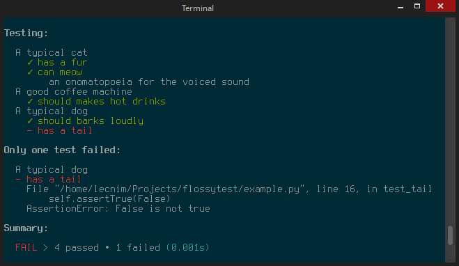
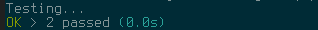

# flossytest

Colorful and beautiful terminal output inspired by [Vows](http://vowsjs.org/)!



Simple test source file powered by docstrings:

```python
import flossytest as unittest

class CoffeMachine(unittest.TestCase):
    """A good coffee machine"""

    def test_success(self):
        """should makes hot drinks"""

class Dog(unittest.TestCase):
    """A typical dog"""

    def test_barking(self):
        """should barks loudly"""
    def test_tail(self):
        """has a tail"""
        self.assertTrue(False)

class Cat(unittest.TestCase):
    """A typical cat"""

    def test_meow(self):
        """can meow"""
        print('an onomatopoeia for the voiced sound')
    def test_fur(self):
        """has a fur"""

if __name__ == "__main__":
    unittest.main()
```

## Installation

Supported python versions:

    3.2
    3.3
    3.4

Download `flossytest.py` script and it is ready to work. No requirements.

## Usage

Import and use it just like `unittest` package:

    import flossytest as unittest

Or run and it will auto-discover available tests:

    $ python flossytest.py

You can also test given file or package:

    $ python flossytest.py my_test.py

## Verbose and minimal mode

Standard minimalistic mode:

    $ python flossytest.py



Verbose mode:

    $ python flossytest.py -v


